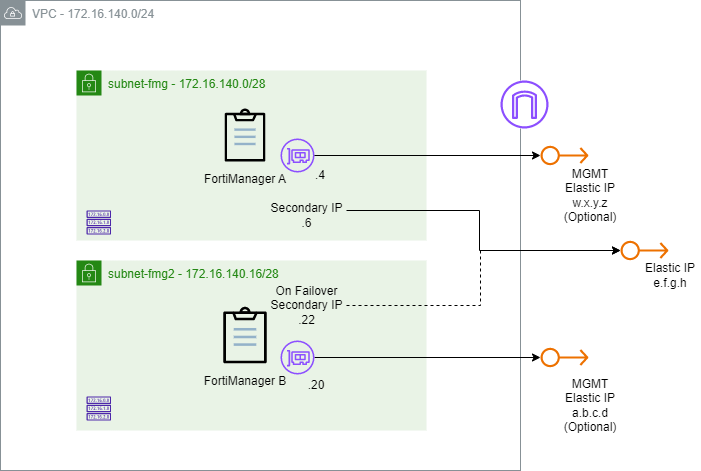
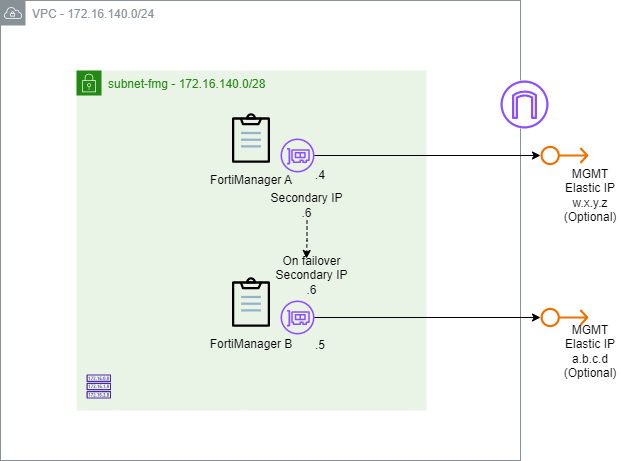

# AWS FortiManager HA Terraform Module

:wave: - [Introduction](#introduction) - [Architecture & Design](#architecture--design) - [HA Modes Configurations](#ha-modes-configurations) - [Terraform Deployment](#terraform-deployment) - [Troubleshooting](#troubleshooting) - :wave:

## Introduction

This repository contains Terraform modules for deploying Fortinet FortiManager on AWS in a High Availability (HA) pair. FortiManager provides centralized management of Fortinet devices configuration, policy and object management, device provisioning, and firmware control across the environment. 
The module automates the compute, networking, IAM, and security-group resources required for an active-passive cluster with VRRP-based automatic failover.

## Architecture & Design

The module supports two topologies, both using VRRP for automatic failover and differing only in whether the VIP is publicly reachable. Choose based on how managed devices reach FortiManager: use the public-VIP mode when FortiGates connect over the internet and you want cross-AZ resilience, or the private-VIP mode for fully internal deployments where everything stays inside the VPC.

1. **VRRP Automatic Failover with Public VIP**

fmg1 and fmg2 land in different subnets / AZs cross-AZ resilience.
Each node gets its own EIP, plus public VIP attached to fmg1.
Once the HA cluster is successfully formed, FazUtil creates a secondary private IP address on eni1 interface of both FortiManager instances and assigns the public VIP to the primary FortiManager. During a failover , the public VIP is automatically reassigned to the new primary FortiManager, ensuring continuous management access.



2. **VRRP Automatic Failover with Private VIP** 

Both nodes sit in the same subnet / AZ.
By default, no public IP addresses are assigned to the FortiManager instances. If direct management access from the internet is required, you can optionally assign public IP addresses to the management interfaces of the FortiManager nodes.
fmg1's ENI carries two private IPs: a primary address and the secondary private VIP HA address. Failover moves this secondary private IP between nodes.



| Component | Resource | Notes |
|-----------|----------|-------|
| Compute | `aws_instance.fmg1`, `aws_instance.fmg2` | Identical sizing; encrypted gp2 100 GB root volume each |
| Log storage | `aws_ebs_volume.fmg{1,2}_logs` | encrypted, log volum 500 GB Mounted as `/dev/sdf` |
| Networking | `aws_network_interface.fmg{1,2}` | One ENI per node as primary interface; `fmg1` ENI holds VIP address in private mode |
| Public addressing | `aws_eip.fmg1`, `aws_eip.fmg2`, `aws_eip.vip` | Created only in public vip mode |
| Access control | `aws_security_group.fortimanager` | Ingress for management, logging, and HA sync |
| Permissions | `aws_iam_role` / `aws_iam_instance_profile` | grants the IP-move permissions needed for failover |

Security group ingress

| Port / Protocol | Source | Purpose |
|-----------------|--------|---------|
| TCP 22 | `admin_cidr` | SSH access |
| TCP 443 | `admin_cidr` | HTTPS management UI |
| TCP 541 | `fortigate_cidr` | FGFM — secure device/log transmission |
| UDP 514 | `fortigate_cidr` | Syslog reception |
| TCP 5199 | `0.0.0.0/0` | FortiManager HA synchronization |

## HA Modes Configurations

1. VRRP Automatic Failover with Public VIP 

**FMG1**

<pre><code>
config system ha
  set failover-mode vrrp
	set clusterid 10
  set hb-interval 5
  set hb-lost-threshold 10
    config peer
      edit 1
        set ip <b>FortiManager B Private IP address</b>
        set serial-number <b>FortiManager B serial number</b>
      next
    end
  set priority 100
  set unicast enable
  set password <b>ha-password</b>
  set vip <b>FortiManager HA Public IP address</b>
  set vrrp-interface "port1"
end
</code></pre>

**FMG2**

<pre><code>
config system ha
  set failover-mode vrrp
	set clusterid 10
  set hb-interval 5
  set hb-lost-threshold 10
    config peer
      edit 1
        set ip <b>FortiManager A Private IP address</b>
        set serial-number <b>FortiManager A serial number</b>
      next
    end
  set priority 1
  set unicast enable
  set password <b>ha-password</b>
  set vip <b>FortiManager HA Public IP address</b>
  set vrrp-interface "port1"
end
</code></pre>

2. VRRP Automatic Failover with Private VIP 

**FMG1**

<pre><code>
config system ha
  set failover-mode vrrp
	set clusterid 10
  set hb-interval 5
  set hb-lost-threshold 10
    config peer
      edit 1
        set ip <b>FortiManager B Private IP address</b>
        set serial-number <b>FortiManager B serial number</b>
      next
    end
  set priority 100
  set unicast enable
  set password <b>ha-password</b>
  set vip <b>FortiManager HA Private IP address</b>
  set vrrp-interface "port1"
end
</code></pre>

**FMG2**

<pre><code>
config system ha
  set failover-mode vrrp
	set clusterid 10
  set hb-interval 5
  set hb-lost-threshold 10
    config peer
      edit 1
        set ip <b>FortiManager A Private IP address</b>
        set serial-number <b>FortiManager A serial number</b>
      next
    end
  set priority 1
  set unicast enable
  set password <b>ha-password</b>
  set vip <b>FortiManager HA Private IP address</b>
  set vrrp-interface "port1"
end
</code></pre>

## Terraform Deployment

### Prerequisites and Requirements

- AWS CLI configured with appropriate permissions
- Terraform >= 1.0
- AWS key pair for SSH access
- For BYOL: Valid FortiManager license file
- [FortiManager Supported instances](https://docs.fortinet.com/document/fortimanager-public-cloud/8.0.0/aws-administration-guide/351055/instance-type-support)
- [FortiManager requires a minimum disk size of 500 GB](https://docs.fortinet.com/document/fortimanager-public-cloud/8.0.0/aws-administration-guide/655204/models)
- During deployment the aws certificate (Amazon-RSA-2048-M01) added for both fmgs. This certificate can also be downloaded from this [link](https://www.amazontrust.com/repository/)

### Features

- **Automated AMI Discovery**: Automatically finds the latest FortiManager AMI based on license type (BYOL/PAYG) and version
- **Flexible Licensing**: Support for both BYOL (Bring Your Own License) and PAYG (Pay As You Go) deployments
- **Security**: Pre-configured security groups with appropriate rules for management and log collection
- **Storage**: Configurable root and log storage volumes with encryption
- **Networking**: Support for existing VPC/subnet infrastructure or automatic configuration
- **IAM Integration**:  IAM roles grants the IP-move permissions needed for failover

### Module Structure

```
terraform-aws-fortimanager/
├── modules/
│   └── ha/                       # HA FortiManager deployment module
├── examples/
│   ├── main.tf                   # Example deployment configuration
│   ├── variables.tf              # Input variable definitions
│   ├── terraform.tfvars.example  # Example variable values
│   └── outputs.tf                # Deployment outputs
└── README.md
```

### Recommendations

1. **Restrict Management Access**: Always specify specific CIDR blocks for `admin_cidr_blocks`
2. **Use Private Subnets**: Deploy in private subnets when possible
3. **Enable Encryption**: Root and log volumes are encrypted by default
4. **Regular Updates**: Keep FortiManager version updated


### Instructions

- Copy all Terraform configuration files into your working directory. Then, rename the file terraform.tfvars.example to terraform.tfvars. 
The terraform.tfvars file contains all configurable input variables for the deployment. 

- Set the variables from terraform.tfvars file

- Run the following commands:

```bash
terraform init
terraform plan
terraform apply
```
- You can delete the integration and remove all created resources using the following command:

```bash
terraform destroy
```

## Outputs

The module provides comprehensive outputs including:
- Instance information (ID, IPs, state)
- Network details (security groups, interfaces)
- Management URLs and SSH connection strings
- Storage and IAM resource information

## Troubleshooting

Run the following command in the FortiManager CLI:

- Displays the current FortiManager High Availability (HA) status, including the HA role (primary/secondary), peer information, synchronization state, and cluster health.
```
fmg1 # get system ha-status
HA Health Status                : OK
HA Role                         : Primary
FMG-HA Status                   : Synchronized State
Model                           : FortiManager-VM64-AWS
Cluster-ID                      : 10
Debug                           : off
File-Quota                      : 4096
HB-Interval                     : 5
HB-Lost-Threshold               : 10
HA Primary Uptime               : Wed Jun 17 06:05:25 2026
HA Primary state change timestamp: Wed Jun 17 06:05:40 2026
HB-Lost-Threshold               : 10
Primary                         : fmg1, FMG-VMTMxxxxx, 172.16.136.105
-----
Cluster member 1: fmg2, FMGVMSTMxxxxxxx, 172.16.137.207
Last Heartbeat                  : 4 seconds ago
Last Sync                       : 32 seconds ago
Last Error                      : 
Total Synced Data (bytes)       : 51089
Pending Synced Data (bytes)     : 0
Estimated Sync Time Left (seconds): 0
HA Sync status                  : up,in-sync
System Usage stats              :
        FMG-VMTM25013243(updated 0 seconds ago):
                average-cpu-user/nice/system/idle=3.41%/0.00%/1.37%/95.17%, memory=6.48%
        FMGVMSTM25005639(updated 4 seconds ago):
                average-cpu-user/nice/system/idle=0.13%/0.00%/0.04%/99.82%, memory=5.73%
```

- Displays the current High Availability (HA) configuration settings on the FortiManager, including the HA mode, group ID, priority, heartbeat interfaces, and other HA-related parameters.
```
fmg1 # get system ha
failover-mode       : vrrp 
mode                : primary 
monitored-interfaces:
monitored-ips:
peer:
    == [ 1 ]
    id: 1           
aws-access-key-id   : (null)
aws-secret-access-key: *
clusterid           : 10
file-quota          : 4096
hb-interval         : 5
hb-lost-threshold   : 10
local-cert          : (null)
password            : *
priority            : 100
unicast             : enable 
vip                 : 13.36.122.218 
vip-interface       : (null)
vrrp-adv-interval   : 3
vrrp-interface      : port1 
```


- Forces the current Primary to release the role. A new election is carried out to find the new Primary. This command is also used to test the VRRP failover. Regardless of the priority, if this command is run on the Primary then it will become a Secondary.

```
diagnose ha force-vrrp-election
```

- Logging of the Azure Rest API calls
```
fmg1 # diagnose ha dump-cloud-api-log
2026/06/17 05:58:42 [aws-ec2] /bin/fazutil --logf=/var/ha/keepalived.log --logf-size=5M aws-ec2 --no-ssl --local add-ips -r --ip 13.36.122.218 --mac 06:45:81:db:45:3f --intf=port1
2026/06/17 05:58:42 [add-ips] addIPs intf-id= instance-id= mac=06:45:81:db:45:3f sencond-ip=13.36.122.218 intf=port1
2026/06/17 05:58:44 [add-ips] created secondary private IP 172.16.136.34 with viptag
2026/06/17 05:58:45 [add-ips] associated: eipassoc-08c4f8d18ee675725
2026/06/17 05:58:45 [add-ips] exec: ip addr add 172.16.136.34 dev port1
2026/06/17 05:58:45 [add-ips] 
```

- Get HA statistics and last error.
```
fmg1 # diagnose ha stats 
===== HA Statistics =====

cluster status: up

--- cluster member information ---

ip                              : 172.16.137.207
serial number                   : FMGVMSTMxxxxxx
hostname                        : fmg2
role                            : secondary
status                          : up
pending sync'ed data(bytes)     : 0
secondary down alert            : off
secondary re-join alert         : off
last error                      : n/a
```
You can find additional commands for viewing and managing HA in the [official documentation](https://docs.fortinet.com/document/fortimanager/8.0.0/cli-reference/698226)

- **After deployment , it could require to retype ha password**

## Supported FortiManager Versions

The module supports FortiManager versions 7.0 and above. You can specify versions using:

- Exact version: `"7.4.5"`
- Major.minor: `"7.4"` (latest patch version)
- Major only: `"7"` (latest version in major release)

## Support

For issues and questions:
1. Check the [examples](examples/) for common use cases
2. Review Fortinet documentation for FortiManager
3. Open an issue in this repository

## References

- [FortiManager AWS Administration Guide](https://docs.fortinet.com/document/fortimanager-public-cloud/7.6.0/aws-administration-guide/)
- [AWS Marketplace - FortiManager](https://aws.amazon.com/marketplace/seller-profile?id=7de3dd38-52b2-4c1a-9fc1-93e7dfca9d6b)
- [Terraform AWS Provider Documentation](https://registry.terraform.io/providers/hashicorp/aws/latest/docs)
