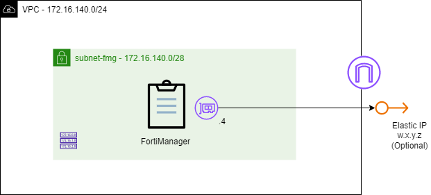

# AWS FortiManager Single Deployment Terraform Module

:wave: - [Introduction](#introduction) - [Architecture & Design](#architecture--design) - [Terraform Deployment](#terraform-deployment) - [Troubleshooting](#troubleshooting) - :wave:

## Introduction

This module deploys a single, standalone Fortinet FortiManager VM on AWS. FortiManager provides centralized management of Fortinet devices — configuration, policy and object management, device provisioning, and firmware control — across the environment. The module provisions the EC2 instance, network interface, optional public IP, optional log volume, security group, and IAM role required to bring up one FortiManager appliance.

## Architecture & Design

The module deploys one FortiManager EC2 instance attached to a single management ENI. A public Elastic IP and a dedicated encrypted log volume are both optional. There is no peer, VIP, or failover logic — for that, use the HA module.



**Deployed components**

| Component | Resource | Notes |
|-----------|----------|-------|
| Compute | `aws_instance.fortimanager` | `m5.large` by default; encrypted gp2 100 GB root volume; IMDSv2 required |
| Networking | `aws_network_interface.fortimanager_mgmt` | Single management ENI; optional static private IP via `private_ip` |
| Public addressing | `aws_eip.fortimanager` | Created only when `create_public_ip = true` |
| Log storage | `aws_ebs_volume.fortimanager_logs` | encrypted gp3 500 GB volume mounted as `/dev/sdf` |
| Access control | `aws_security_group.fortimanager` | Ingress for management and logging (see below) |
| Permissions | `aws_iam_role` / `aws_iam_instance_profile` | Optional; read-only describe + logs + SSM |
| AMI | `data.aws_ami.fortimanager_{byol,payg}` | Latest Marketplace AMI for the chosen license type/version |

**Security group ingress**

| Port / Protocol | Source | Purpose |
|-----------------|--------|---------|
| TCP 22 | `admin_cidr` | SSH access |
| TCP 443 | `admin_cidr` | HTTPS management UI |
| TCP 541 | `fortigate_cidr` | FGFM — secure device/log transmission |
| UDP 514 | `fortigate_cidr` | Syslog reception |

**IAM Permissions**

When `create_iam_role = true`, the instance role grants read-only access to EC2 infrastructure metadata plus CloudWatch Logs and SSM Parameter access.

```json
{
  "Version": "2012-10-17",
  "Statement": [
    {
      "Effect": "Allow",
      "Action": [
        "ec2:DescribeInstances",
        "ec2:DescribeRegions",
        "ec2:DescribeAvailabilityZones",
        "ec2:DescribeVpcs",
        "ec2:DescribeSubnets",
        "ec2:DescribeSecurityGroups",
        "ec2:DescribeNetworkInterfaces",
        "ec2:DescribeVolumes",
        "ec2:DescribeSnapshots"
      ],
      "Resource": "*"
    },
    {
      "Effect": "Allow",
      "Action": [
        "logs:CreateLogGroup",
        "logs:CreateLogStream",
        "logs:PutLogEvents",
        "logs:DescribeLogStreams",
        "logs:DescribeLogGroups"
      ],
      "Resource": "*"
    },
    {
      "Effect": "Allow",
      "Action": [
        "ssm:GetParameter",
        "ssm:GetParameters",
        "ssm:GetParametersByPath"
      ],
      "Resource": "*"
    }
  ]
}
```

## Terraform Deployment

## Prerequisites and Requirements

- AWS CLI configured with appropriate permissions
- Terraform >= 1.0 and AWS provider >= 5.0
- An existing VPC and subnet (`vpc_id`, `subnet_id`)
- AWS key pair for SSH access (`key_name`)
- For BYOL: a valid FortiManager license file or FortiFlex token
- [FortiManager supported instances](https://docs.fortinet.com/document/fortimanager-public-cloud/8.0.0/aws-administration-guide/351055/instance-type-support)
- [FortiManager requires a minimum disk size of 500 GB](https://docs.fortinet.com/document/fortimanager-public-cloud/8.0.0/aws-administration-guide/655204/models)

### Features

- **Automated AMI Discovery**: Automatically finds the latest FortiManager AMI based on license type (BYOL/PAYG) and version
- **Flexible Licensing**: Support for both BYOL (Bring Your Own License) and PAYG (Pay As You Go) deployments
- **Security**: Pre-configured security group for management and log collection; IMDSv2 is enforced on the instance
- **Storage**: Configurable, encrypted root and optional log volumes
- **Networking**: Deploys into an existing VPC/subnet, with an optional static private IP and optional Elastic IP
- **IAM Integration**: Optional IAM role with read-only EC2 describe, CloudWatch Logs, and SSM Parameter access

### Module Structure

```text
terraform-aws-fortimanager/
├── modules/
│   ├── single/                       # Single FortiManager deployment module
├── examples/
│   ├── single/                       # Single example deployment
│   │   ├── main.tf
│   │   ├── variables.tf
│   │   ├── terraform.tfvars.example
│   │   ├── outputs.tf
└── README.md
```

### Recommendations

1. **Restrict Management Access**: Set `admin_cidr` to specific ranges, and narrow the SSH rule from `0.0.0.0/0`.
2. **Use Private Subnets**: Deploy in a private subnet and set `create_public_ip = false` where possible.
3. **Enable Encryption**: Root and log volumes are encrypted by default — keep it that way.
4. **Protect the Instance**: Consider `enable_termination_protection = true` for production.
5. **Regular Updates**: Keep the FortiManager version updated.


### Instructions

- Copy the Terraform configuration into your working directory, then rename `terraform.tfvars.example` to `terraform.tfvars`. The terraform.tfvars file contains all configurable input variables for the deployment.
- Set the variables from terraform.tfvars file.
- Run the following commands:

```bash
terraform init
terraform plan
terraform apply
```

- Remove all created resources with:

```bash
terraform destroy
```

### Outputs

- Instance and network details: Provides identifiers and connectivity information including instance_id, private_ip_address, public_ip_address (if enabled), network_interface_id, and availability_zone for operational and networking reference.
- Security and access configuration: Exposes security-related metadata such as security_group_id, iam_role_arn, and iam_instance_profile_name to support auditing and access validation.
- Deployment and image information: Includes ami_id, ami_name, fortimanager_version, and fmg_license_type to identify the exact image, version, and licensing used for the deployment.
- Storage and operational summary: Provides log_volume_id (if enabled) and a consolidated deployment_summary containing key runtime details such as region, IP addresses, and default access information.

## Troubleshooting

Check basic system status from the FortiManager CLI:

```
get system status
```

## Support

For issues and questions:
1. Check the [examples](../../examples/) for common use cases
2. Review Fortinet documentation for FortiManager
3. Open an issue in this repository

## References

- [FortiManager AWS Administration Guide](https://docs.fortinet.com/document/fortimanager-public-cloud/8.0.0/aws-administration-guide/)
- [AWS Marketplace - FortiManager](https://aws.amazon.com/marketplace/seller-profile?id=7de3dd38-52b2-4c1a-9fc1-93e7dfca9d6b)
- [Terraform AWS Provider Documentation](https://registry.terraform.io/providers/hashicorp/aws/latest/docs)
